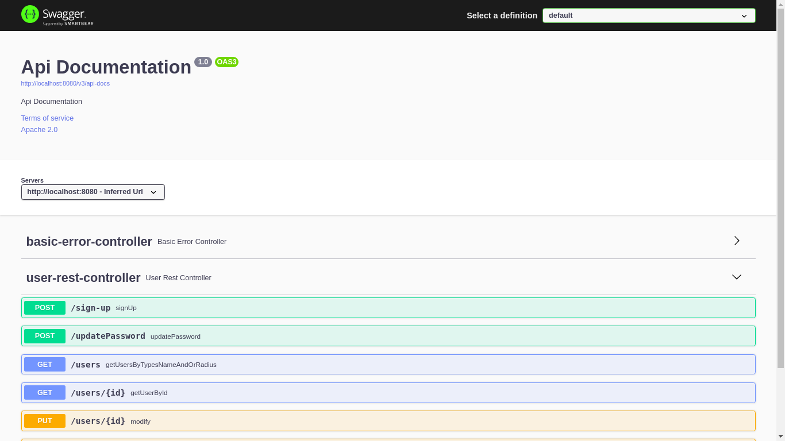
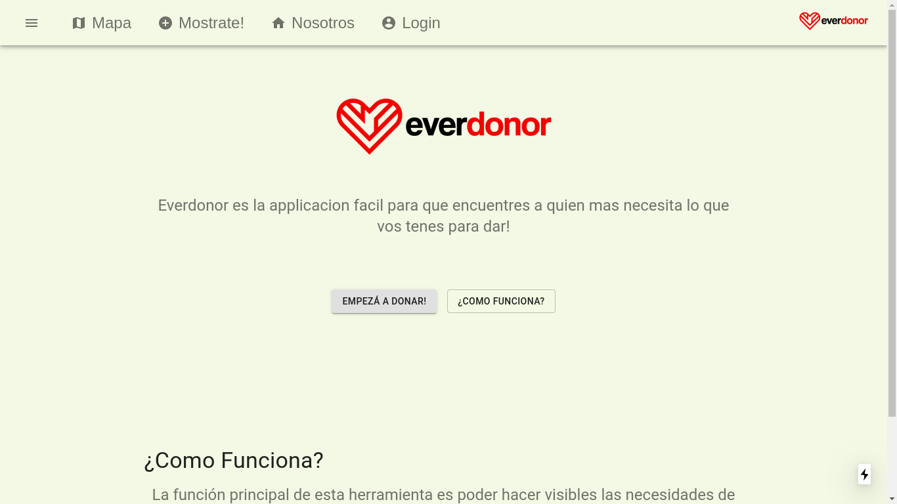
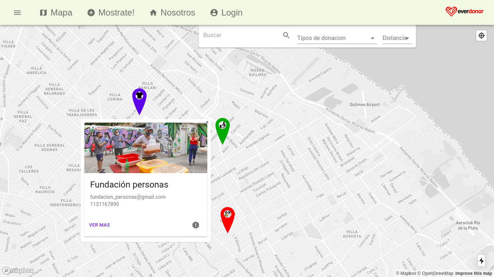
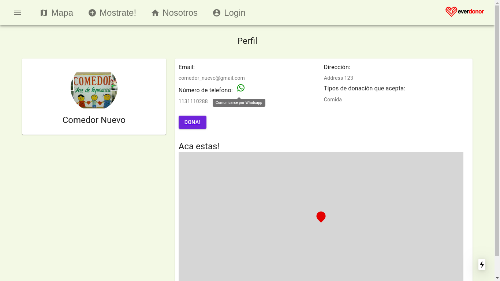
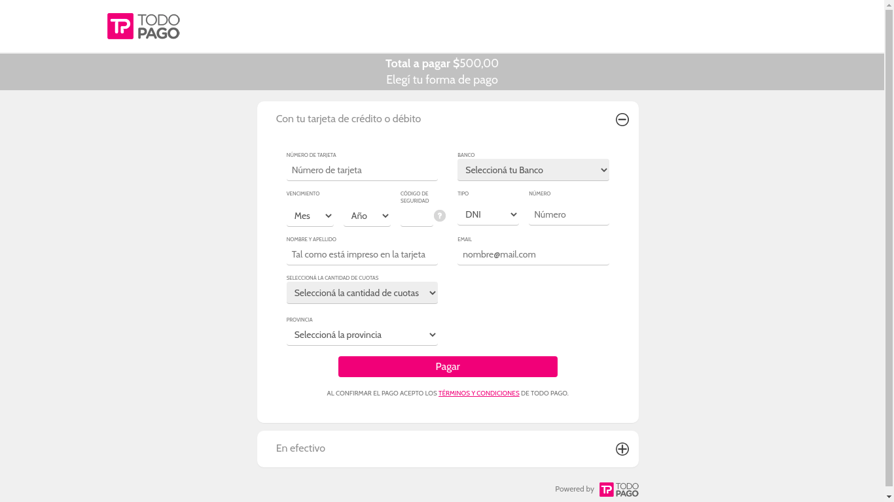
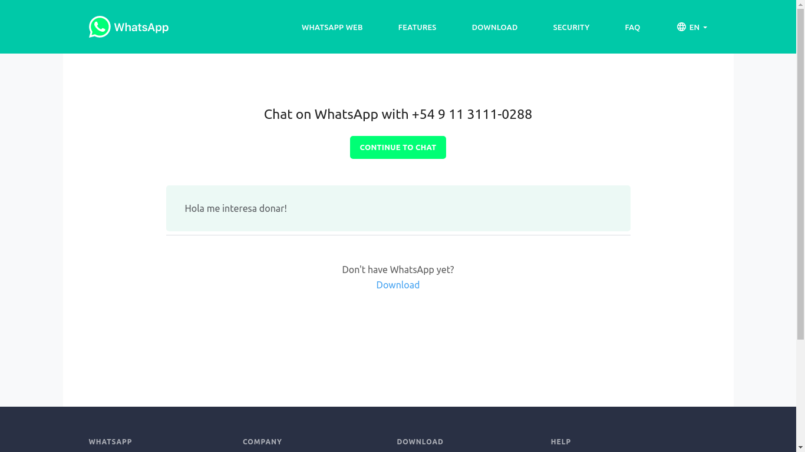

# Entrega 3

## Funcionalidades

Para la tercer entrega decidimos preparar toda la documentación de nuestra API para poder ser utilizada por terceros que quieran aprovechar la funcionalidad que proveemos.

A su vez integramos un boton opcional para aceptar pagos mediante Todo Pago, para los usuarios que cuenten con una cuenta en la plataforma y quieran habilitar la posibilidad de recibir donaciones de dinero a travez de ese medio, y agregamos integracion con WhatsApp para habilitar la opción de comunicarse directamente con el centro mediante el servicio.

Mejoramos las queries de busqueda para poder hacer consultas con multiples opciones.

Tambien se incluyeron mejoras en el diseño de algunas paginas y mejoras de UI para los markers para distinguir mejor los distintos tipos de donaciones en el mapa con un vistazo rapido.

## Capa de presentación

  

  

  

  

  

  

## Casos de uso

  

El usuario con rol de donante puede hacer donaciones de dinero.

El usuario con rol de donante puede comunicarse rapidamente por mensajeria instantanea

El usuario con rol de donado puede agregar WhatsApp como forma de contacto

El usuario con rol de donado puede agregar Todo Pago como forma de donación
