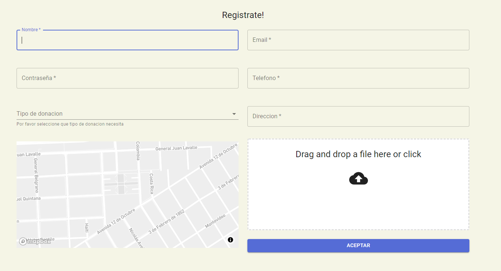
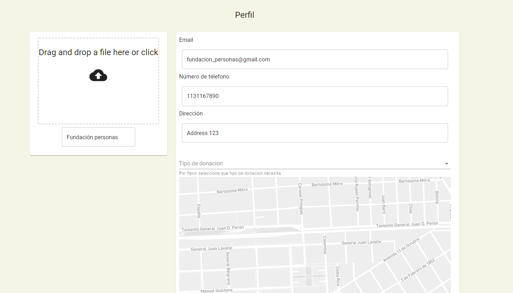

# Entrega 1

## Funcionalidades

Para la primer entrega se decidio crear el flujo de Alta-Baja-Modificacion dentro la aplicacion con la alta consistiendo de un formulario con campos a llenar, la modificacion con un perfil swappeable que funciona como "mas info" y modificacion y la baja mediante una cantidad N de reportes

## Capa de presentación

  

  

## Casos de uso

  

El usuario con rol de donante ingresa al mapa y puede reportar entidades que no cumplas con las normas.

El usuario con rol de donado puede registrartse y modificar su informacion