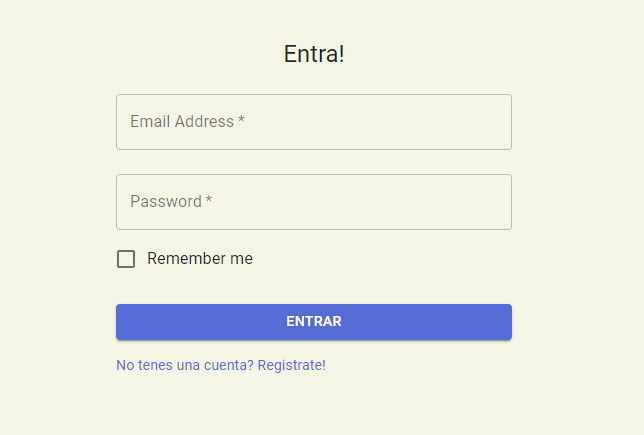
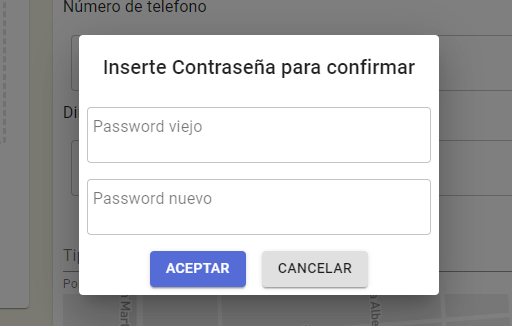

# Entrega 1

## Funcionalidades

Para la segunda entrega se decidio agrega el servicio de Login, la busqueda por distancia a la redonda, mejorar el feeling en el registro, cambiar los tipos de donaciones que reciben para que sean listas en vez de un elemento solo, se agregaron test de front y se investigo sobre integraciones de third party, sumado a algunas mejoras de ui
## Capa de presentación

  

  

  

## Casos de uso

  

El usuario con rol de donante ingresa al mapa y quiere buscar por distancia a la redonda

El usuario con rol de donado puede modificar su contraseña