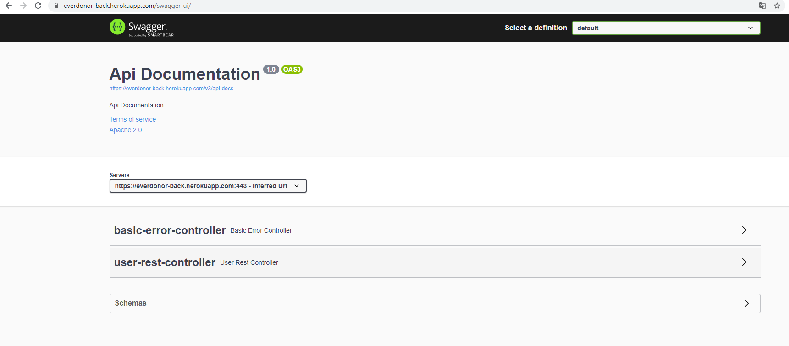
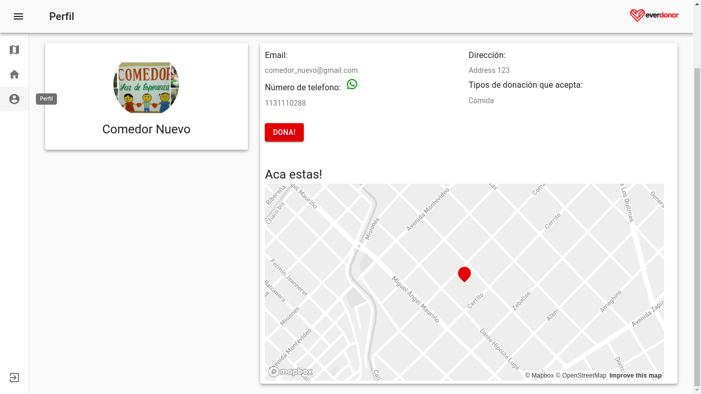
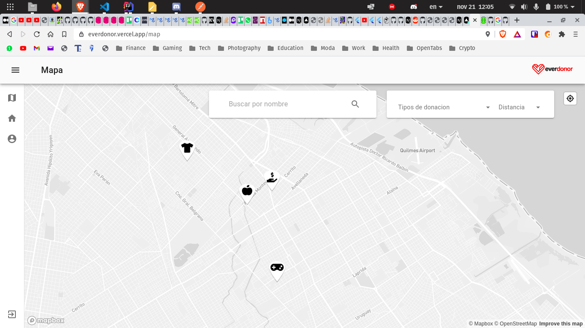
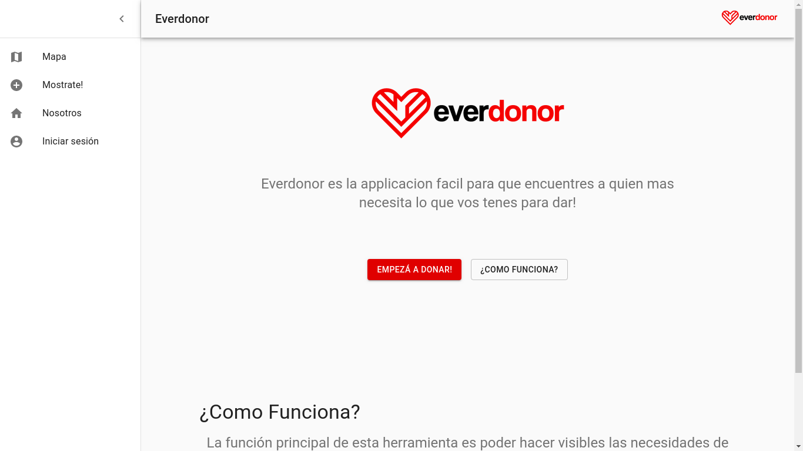

# Entrega 4

## Funcionalidades

Para la cuarta entrega decidimos preparar toda la aplicacion para ser deployeada en Vercel y Heroku

A su vez hubo un complete overhaul visual de la aplicacion, se mejoro la experiencia del usuario y se intento hacer que sea agradable moverse

Tambien se mejoro el tutorial de creacion de boton de todo pago 

## Capa de presentación

  

  

  

  

## Casos de uso

  

No se agregaron casos de uso nuevo sino que se modificaron los ya existentes