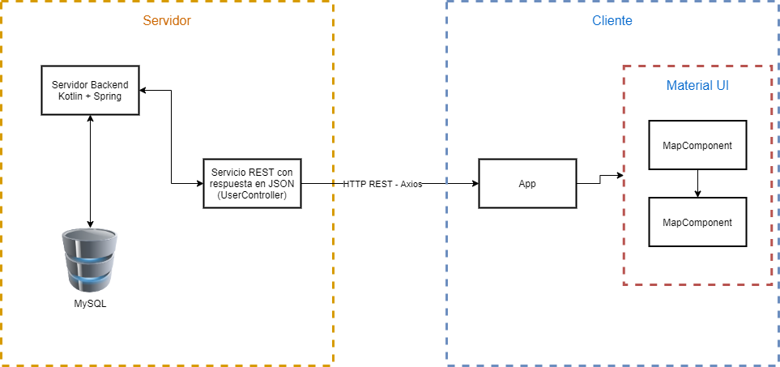

# Everdonor Documentacion

  

## Proposito

El proposito de esta aplicacion es facilitar la conexion entre gente con ganas de donar y centros u organizaciones que distribuyan a personas en situacion de necesitad. Buscamos lograr este objetivo mediante una interfaz simple e intuitiva que logre hacer la localizacion del donante y mostrar los centros mas cercanos.

## Arquitectura

  

La aplicación está dividida en dos grandes partes, una parte de cliente y una de servidor.

La parte de cliente es la cargada de mostrar los datos de cada unos de los Donados/Donadores de manera tal que se pueda navegar fluidamente y encontrar la informacion que uno necesita.

## Repositorios

- [Repositorio de servidor frontend](https://github.com/Everdonor/Everdonor-Front-End)

- [Repositorio de servidor backend](https://github.com/Everdonor/everdonor-backend)

## Tecnologias

- **[React](https://reactjs.org/docs/getting-started.html):** para el desarrollo del frontend utilizamos React (biblioteca escrita en JavaScript), facilita la creación de componentes interactivos y reutilizables.
- **[Spring Boot](https://docs.spring.io/spring-boot/docs/current/reference/htmlsingle/):** Como framework para el desarrollo de la aplicación por todas las herramientas que disponibiliza para facilitar el "cableado" entre las capas de servicios y controllers, simplificación de sintaxis y orquestado de la arquitectura backend.
- **[Kotlin](https://kotlinlang.org/docs/reference/):** Utilizamos Kotlin como el lenguaje de nuestro backend por su flexibilidad como lenguaje, su integración con Spring y por estar montado sobre la JVM (siendo Java un lenguaje al que estamos acostumbrados).
- **[MySQL DB](https://dev.mysql.com/doc/):** En principio utilizamos MySQL para la Base de Datos tal ya que inicialmente, el modelo es simple.

## CI

Como herramienta de integracion continua estamos utilizando [Travis](https://travis-ci.org/) por su facilidad de uso, configuración e integración con el repositorio.

## Conectividad Servidor - Cliente

El servidor front realiza toda su comunicacion con el cliente a travez de llamadas HTTP Rest a localhost

## Deployment

Como host y herramienta de deployment planeamos utilizar [Zeit](https://zeit.co/) para el frontend y [Heroku](https://www.heroku.com) para el backend. El porque de utilizar diferentes host proviene de la especialidad de cada plataforma, las cuales brinda herramientas particulares para cada tipo de servidor.

## Entregas

- [Prueba de concepto](Prueba%20de%20Concepto.md)
- [Entrega 1](Entrega-1.md)
- [Entrega 2](Entrega-2.md)
- [Entrega 3](Entrega%203.md)
